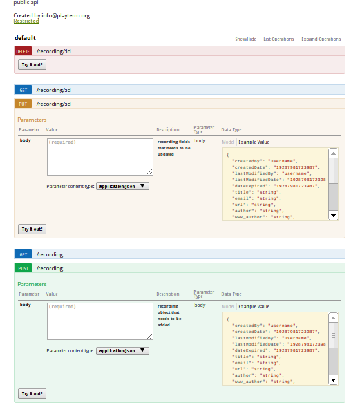

generate beautiful online swagger docs based on your deployd resources

## Usage

    $ cd your-deployd-dir
    $ npm install dpd-event dpd-swagger-doc

Bit of symlink magic:

    $ cp -R node_modules/dpd-swagger-doc/resource resources/swagger
    $ cd public && ln -s ../node_modules/dpd-swagger-doc/node_modules/swagger-ui/dist apidoc && cd -

> Done! Now edit `resource/swagger/get.js` to configure the generated docs, and surf to `http://localhost/apidoc/?url=/swagger#!/default` to see the generated docs 

## Documenting Collection resources 

It's very simple, just put this in your config (`resources/foo/config.json` e.g.):

    {
      "type": "Collection",                
      "properties": {
        "createdBy": {
            "name": "createdBy",
            "type": "string",
            "typeLabel": "string",
            "required": false,
            "id": "createdBy",
            "default":"username",                     <--  add this to automatically have generated mock payloads
            "order": 0
        },

        ....

      }
      "swagger":{                                     <--
        "pluralName": "items",                        <--
        "methods":{                                   <--
          "get": {                                    <--
            "public":true,                            <--
            "description": "Creates a item",          <--
            "produces": [ "application/json" ],       <--
            "schema": {                               <--
              "payload": {},                          <--
              "query": { "type": "object" }           <--
            }                                         <--
          }                                           <--
        }                                             <--
      }
    }

## Documenting Custom resources 

It's very simple, just put this in your config (`resources/foo/config.json` e.g.):

    {
      "type": "XXXXX", 
      "swagger":{                                     <--
        "pluralName": "items",                        <--
        "methods":{                                   <--
          "get": {                                    <--
            "public":true,                            <--
            "description": "Creates a item",          <--
            "produces": [ "application/json" ],       <--
            "schema": {                               <-- 
              "payload": {},                          <-- payload jsonschema
              "query": { "type": "object" }           <-- query arguments jsonschema
            }                                         <--
            "responses"{
              "200":{
                schema: { 
                  "type":"object",                    <-- jsonschema of response 
                  "properties":{
                    "foo"{
                      "type":"string", 
                      "default":"bar"
                    }
                  }
                }
              }
            }
          }                                           
        }                                             
      }
    }
